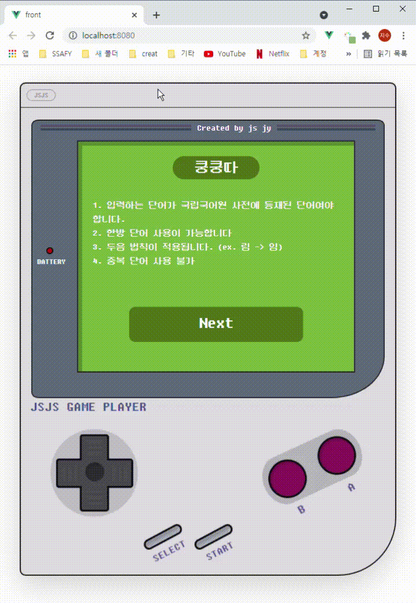
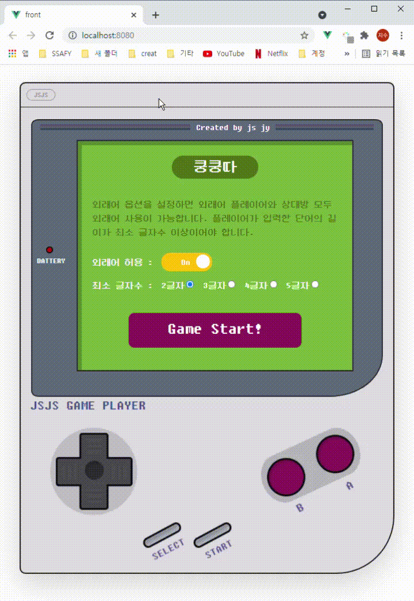

# 끝말잇기

> 2021.03 초기 Django로 개발
>
> 2021.06 Django REST frame work + Vue.js 로 업데이트


## 목적

- 웹개발 연습
- 간단한 toy project 구현, 애니메이션 연습
- 학습 내용 복기


## 개요

#### 클라이언트

- Vue.js
- axios로 서버 API에 요청
- props, emit으로 데이터 처리
- CSS 애니메이션


#### 서버

- Django REST frame work
- 끝말잇기 규칙(이전 단어의 마지막 글자 확인, 두음법칙, 중복단어, 옵션,,)
- 국립국어원 API 활용


## Preview


## 상세내용 _ front

#### install

```json
"axios": "^0.21.1",
"bootstrap": "^5.0.1",
"bootstrap-vue": "^2.21.2",
"core-js": "^3.6.5",
"vue": "^2.6.11"
```


#### Design

- 레이아웃 & 컨셉 : 90's 닌텐도 게임기(핀터레스트 참고)
- font : 둥근모꼴


#### 컴포넌트

- App.vue : 최상단 컴포넌트
- components
  - Option
    - OnOffToggle.vue : 외래어 옵션 토글 버튼
    - SelectTextLen.vue : 최소 글자수 옵션 라디오 버튼
  - Introduce.vue : 맨 처음 룰 설명하는 컴포넌트 (1)
  - SelectOption.vue : Next 클릭시 나오는 옵션 선택 컴포넌트 (2)
  - GameStage.vue : 끝말잇기 진행중 보여지는 컴포넌트 (3)
  - Lose.vue : 패배 화면 (4) 
  - Win.vue : 승리 화면 (5)


#### 구현 설명

✅ **App.vue**

- 화면의 단계가 진행될 때마다 emit으로 현재 진행 상태를 최상단인 app에 전달한다.
- `status` 를 통해 현재 화면에 보여질 컴포넌트가 결정된다.

```html
<div class="realScreenArea">
    <Introduce v-if="status === 1" @status-change="StatusChange"/>
    <SelectOptions v-else-if="status === 2" @status-change="StatusChange" @set-game-options="setGameOption"/>
    <GameStage v-else-if="status === 3"
               :foreign="foreign"
               :textLen="textLen"
               @status-change="StatusChange"
               />
    <Lose v-else-if="status === 4"/>
    <Win v-else-if="status === 5"/>
</div>
```


✅ **Introduce.vue**



- 첫 화면에서 게임 규칙을 설명하고, Next 버튼을 누를 수 있다.
- 버튼을 클릭하면 이벤트를 발생시켜 부모 컴포넌트로 데이터를 전달한다. 
- 버튼에 마우스 오버시 색 변화, 그림자 효과를 준다.

```vue
<template>
  <div>
    <div>
      <h3 class="subHeadline">쿵쿵따</h3>
      <div>
        <div>1. 입력하는 단어가 국립국어원 사전에 등재된 단어여야 합니다.</div>
        <div>2. 한방 단어 사용이 가능합니다</div>
        <div>3. 두음 법칙이 적용됩니다. (ex. 림 -> 임) </div>
        <div>4. 중복 단어 사용 불가 </div>
      </div>
      <br>
      <br>
      <div class="Button" @click="Next">Next</div>
    </div>
  </div>
</template>

<script>
export default {
  name: 'Introduce',
  methods: {
    Next() {
      this.$emit('status-change', 2)
    }
  }

}
</script>

<style scoped>
.Button {
  color: white;
  font-size: 30px;
  background-color: rgb(81, 112, 24);
  border-radius: 10px;
  text-align: center;
  width: 300px;
  height: 60px;
  padding-top: 5px;
  margin: 0px auto;
  transform: translate(0px, 20px);
  transition-duration: 0.1s;
  cursor: pointer;
}

.Button:hover {
  background-color: rgb(101, 139, 30);
  box-shadow: 1px 5px 0px rgba(0, 0, 0, 0.119);
}
</style>
```


✅ **SelectOption.vue** > **OnOffToggle.vue**



- OnOff toggle 기능
- 뒷 배경, 글자, 원 세가지의 위치 설정을 위해 z-index를 사용한다. z-index를 사용하기 위해서는 반드시 position 설정이 필요하다.
- 원의 부드러운 이동을 위해 transition 속성을 설정한다. 기본이 되는 스타일 설정에 transition 속성을 작성해두면, 스타일이 변경될때 애니메이션처럼 보여진다.

```vue
<template>
  <div style="height: 2rem; position: relative;">
    <div :class="{ optionBody: true, optionBodyTrue: option, optionBodyFalse: !option}" @click="toggleOption">
      <div class="optionText">
        <p v-if="option">On</p>
        <p v-else>Off</p>
      </div>
      <div :class="{ optionCircle: true, optionCircleTrue: option, optionCircleFalse: !option}"></div>
    </div>
  </div>
</template>

<script>
export default {
  name: 'OnOffToggle',
  data() {
    return {
      option: 1,
    }
  },
  methods: {
    toggleOption() {
      this.option = (this.option + 1) % 2 // 1 -> 0, 0 -> 1
      this.$emit('foreign-option', this.option)
    }
  }
}
</script>

<style>
.optionBody{
  width: 5.5rem;
  height: 2rem;
  border-radius: 15px;
  z-index: 0;
  position: absolute;
  cursor: pointer;
  transition-duration: 0.5s;
}

.optionBodyTrue{
  background-color: #FFC107;
}

.optionBodyFalse{
  background-color: #bebebe;
}

.optionText{
  padding-top: 4px;
  padding-left: 34px;
  z-index: 1;
  position: absolute;
}

.optionCircle {
  margin-top: 3px;
  margin-right: 3px;
  margin-left: 3px;
  width: 1.5rem;
  height: 1.5rem;
  border-radius: 50%;
  background-color: white;
  z-index: 2;
  position: relative;
  transition-duration: 0.5s;
}

.optionCircleTrue {
  transform: translate(57px, 0px)
}

.optionCircleFalse {
  transform: translate(1px, 0px)
}
</style>
```


✅ **SelectOption.vue** > **SelectTextLen.vue**

- 체크 박스의 요소를 한개만 선택하게 할때는 radio로 하면 된다. 중복 선택이 가능하게 하려면 checkbox로 설정하면 된다.
- type을 radio로, name을 모두 동일하게 하고 v-model을 설정하면, 선택된 요소를 변수 한개로 받을 수 있다.
- str을 num으로 바꾸는 가장 간단한 방법은 str*1을 해서 자동형변환 하는 것이다.
- watch로 선택된 radio 요소가 바뀔 때마다 emit 이벤트를 발생시킨다.

```vue
<template>
  <div>
    <div class="checkBox">
      <div>
        <label for="2">2글자</label>
        <input id="2" name="textLen" v-model="selectedValue" value="2" type="radio">
      </div>
      <div>
        <label for="3">3글자</label>
        <input id="3" name="textLen" v-model="selectedValue" value="3" type="radio">
      </div>
      <div>
        <label for="4">4글자</label>
        <input id="4" name="textLen" v-model="selectedValue" value="4" type="radio">
      </div>
      <div>
        <label for="5">5글자</label>
        <input id="5" name="textLen" v-model="selectedValue" value="5" type="radio">
      </div>
    </div>
  </div>
</template>

<script>
export default {
  name: 'SelectTextLen',
  data(){
    return {
      selectedValue: 2
    }
  },
  watch: {
    selectedValue() {
      this.$emit('textlen-option', this.selectedValue*1) // 자동형변환!
    }
  }
}
</script>
```


✅ **GameStage.vue**

- 말풍선은 이 [사이트](https://projects.verou.me/bubbly/)를 참고했다.
- 사용자 입력은 v-model로 연결했다.
- 엔터를 누르면 서버로 요청을 보낸다. 서버에서 돌아오는 응답의 상태에 따라 결과를 다르게 표시한다.
- props로 받은 외래어 허용 옵션과 최소 글자수 옵션을 axios 요청의 파라미터로 사용한다.

```vue
<template>
  <div>
    <h3 class="subHeadline">쿵쿵따</h3>
    <div class="d-flex justify-content-between">
      <div class="d-flex flex-column align-items-start">
        <span class="player-speech-bubble">{{ inputTxt }}</span>
        <div class="d-flex flex-column align-items-center">
          
          <div>player</div>
        </div>
      </div>

      <div class="d-flex flex-column align-items-end justify-content-between">
        <span class="ai-speech-bubble"> {{ AItxt }} </span>
        <div class="d-flex flex-column align-items-center">
          
          <div>AI</div>
        </div>
      </div>
    </div>
    <br>
    <div class="input-group mb-3">
      <input @keyup.enter="UserInput" type="text" class="form-control" v-model="inputTxt" aria-describedby="button-addon" autofocus>
      <button @click="UserInput" class="btn btn-outline-success" type="button" id="button-addon">쿵쿵따!</button>
    </div>
  </div>
</template>

<script>
import axios from 'axios'

export default {
  name: 'GameStage',
  data() {
    return {
      inputTxt: '',
      AItxt: '...'
    }
  },
  props: {
    foreign: {
      type: Number
    },
    textLen: {
      type: Number
    }
  },
  methods: {
    UserInput(){
      axios.post(`${process.env.VUE_APP_API_URL}word/user/${this.foreign}/${this.textLen}/`, {content: this.inputTxt})
        .then(res => {
          // 통과
          if (res.data.result === 1) {
            this.AItxt = '...' // AI 생각중
            this.AIInput()// AI의 입력 요청 보내기
          } else { // Lose 화면 띄우기
            this.$emit('status-change', 4)
            console.log('당신이 졌습니다.', res.data.msg)
          }
        })
        .catch(err => {
          console.log(err)
        })

    },
    AIInput(){
      axios.post(`${process.env.VUE_APP_API_URL}word/ai/${this.foreign}/${this.textLen}/`)
        .then(res => {
          // 통과
          if (res.data.result === 1) {
            this.AItxt = res.data.word // AI 입력 말풍선에 업데이트
            this.inputTxt = '' // 인풋 비우기
          } else { // Win 화면 띄우기
            this.$emit('status-change', 5)
            console.log('당신이 이겼습니다.', res.data.msg)
          }
        })
        .catch(err => {
          console.log(err)
        })

    }
  }
}
</script>
```


## 상세내용 _ back

#### install

```json
django-cors-headers==3.7.0
djangorestframework==3.12.4
bs4==0.0.1
requests==2.25.1
...
```


#### settings

- `corsheaders` 
  - 서로 다른 origin (ip는 같지만, 포트번호가 다름. 프론트 8080, 서버 8000) 에서 요청과 응답을 주고 받을 때 필요
  - 서버는 상관 없는데 브라우저에서 CORS 오류가 뜨기 때문에 반드시 설정해야 한다.

```python
INSTALLED_APPS = [
    'word',
    'corsheaders',
    'rest_framework',
    ...
]

MIDDLEWARE = [
    ..
    'corsheaders.middleware.CorsMiddleware', # CORS 추가
    'django.middleware.common.CommonMiddleware',
    ..
]

CORS_ALLOW_ALL_ORIGINS = True
```


#### urls

```python
urlpatterns = [
    path('user/<int:foreign>/<int:txtlen>/', views.user_input), # 사용자 입력 검증 및 저장
    path('ai/<int:foreign>/<int:txtlen>/', views.ai_input), # AI 입력 검증 및 저장
    path('reset/', views.reset), # 리셋
]
```


#### views

- 사용자 입력

  1. 중복 단어가 있는지
  2. 끝말잇기 규칙에 있는지
  3. 국립국어원에 등재되어 있고, 선택한 옵션에 맞는지

  - 위 3가지가 모두 만족하는 경우 DB에 저장, 그렇지 않으면 **사용자의 패배!**

- AI 입력 : 사용자 입력의 끝 글자로 탐색

  1. 그 단어로 시작하는 글자가 있는지
     - 있다면 그 중에 랜덤 1개 출력
     - 없다면, 두음 법칙 적용 하기 ( ㄹ -> ㅇ , ㄴ -> ㅇ)
       - 두음법칙 적용한 글자로 시작하는 단어가 있다면 그중에 랜덤 1개 출력
       - 두음법칙 불가 or 두음법칙해도 없다면 -> **사용자의 승리!**


## 마무리

- 프론트 꾸미는데 시간이 굉장히 오래 들었다. 레이아웃을 안짜고 꾸미면서 동시에 하니까 진도가 안나간다.
- 프로젝트에서는 기획 단계에서 디자인이나 레이아웃을 무조건 먼저 짜고 레퍼런스로 만들어서 그대로 따라 가는 게 좋을 것 같다.
- onoff 토글은 라이브러리가 있었지만, 직접 만들어보기로 했고 성공했다. 효율적인지는 모르겠지만 라이브러리 직접 만들어보는 것도 좋은 것 같다.
- 프론트 하단에 버튼들도 직접 js, css, html로 만들어서 마우스 이벤트를 주고 싶었지만, 시간관계상 포토샵으로 이미지 만들어서 붙여넣었다.
- vue, django 안쓴지 한달 안되었는데 벌써 몇몇 가물가물했다. 주말에는 프로젝트 하나씩 하면 좋을 것 같다.